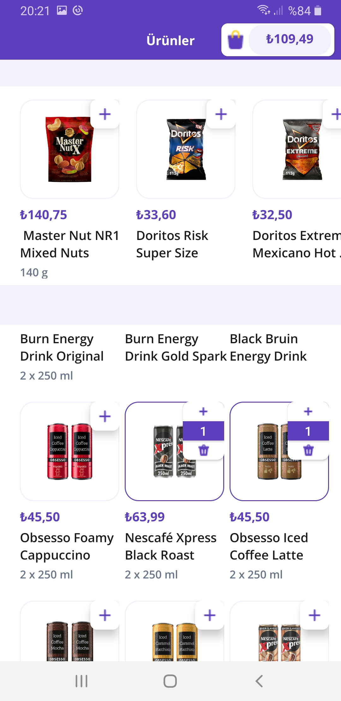
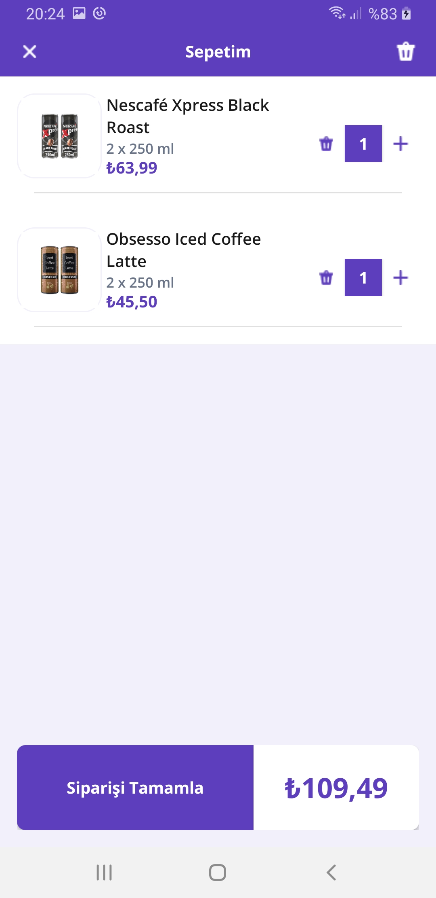

# Getir Android Kotlin Bootcamp Final Project

## Project Overview
This project was developed as part of the Getir and Patika bootcamp. It showcases a modular approach in Android app development, highlighting the use of modern Android development tools.

## Features
- **E-Commerce Functionality**: Allows users to browse products, add items to their cart, and manage their shopping cart.
- **Modular Architecture**: Demonstrates a clean codebase using a modular approach to separate concerns, which enhances maintainability.
- **Unit Tests**: Includes extensive unit testing of the ViewModel to ensure business logic is correctly implemented.
- **Shimmer Effect**: Utilizes a Shimmer RecyclerView to enhance the user experience during data load times.

## Technology Stack
- **Kotlin**: Primary language for app development.
- **MVVM Architecture**: Uses the Model-View-ViewModel (MVVM) architecture for robust and scalable application structure.
- **Coroutines & Flow**: For asynchronous tasks and reactive programming.
- **Hilt-Dagger**: Used for dependency injection.
- **Retrofit**: Used for network operations.
- **Jetpack Components**: Includes LiveData, Navigation, ViewModel, etc., for lifecycle management and UI.
- **Espresso & JUnit**: Used for comprehensive unit and UI testing.

## Shimmer RecyclerView
The Shimmer effect is implemented using the ShimmerRecyclerView library, providing an animated loading placeholder before data retrieval completes.

## Unit Tests
Unit tests for `SharedViewModel` validate the business logic around product interactions such as adding to cart, updating quantities, and fetching products. Here’s a brief on the test setup:
- **Mocking**: Utilizes MockK for mocking dependencies.
- **Coroutines**: Tests asynchronous logic using `kotlinx-coroutines-test` for managing coroutine scopes in tests.
## Screenshots

